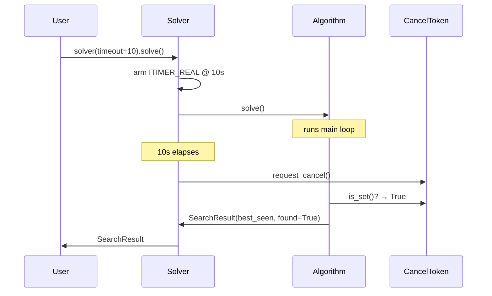
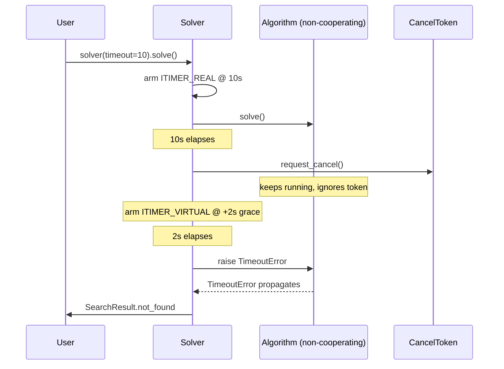

# Cancel-token protocol

PATHOS uses a lightweight cooperative cancellation primitive. Every algorithm
checks `space._cancel_requested()`
inside its main loop and returns its best-so-far cleanly when the token is set
— no exceptions raised, no work discarded.

This single mechanism powers two user-visible features:

1. `solver(timeout=…)` returns the best incumbent on expiry instead of
   `not_found`. Metaheuristics in particular become naturally anytime — a
   `GeneticAlgorithm.solve()` interrupted at second 8 of 10 returns the best
   individual seen in those 8 seconds.
2. Meta-algorithms like [`AnytimeAStar`][pathos.algorithms.informed.AnytimeAStar]
   compose other algorithms and use the token to skip remaining phases when
   the budget is exhausted. See [Modes & Anytime delivery](modes-and-anytime.md).

## How the Solver sets the token

When `Solver.solve()` is called with a `timeout`:

1. Primary `SIGALRM` (`ITIMER_REAL`) is armed at `timeout` seconds.
2. When it fires, the handler **sets the cancel token** —
   `space._request_cancel()`.
   The currently-running algorithm sees the flag at its next check point
   and returns `SearchResult(best_seen, …, found=True, …)` cleanly.
3. **Watchdog backstop**: 2 seconds after the primary signal, a secondary
   `SIGVTALRM` (`ITIMER_VIRTUAL`) fires. Its handler raises `TimeoutError`,
   which `Solver.solve()` catches and converts to `SearchResult.not_found`.
   This handles algorithms that don't check the token (currently: `IDA*`,
   `Backtracking`, `ForwardChecking`, `MinConflicts`).



If the algorithm doesn't check (e.g. `IDA*`):



## Algorithms that cooperate (v1)

All of these check the token at the top of their main loop and return
best-so-far on cancel:

- **Metaheuristics**: `HillClimbing`, `TabuSearch`, `LocalBeamSearch`,
  `SimulatedAnnealing`, `GeneticAlgorithm`, `DifferentialEvolution`,
  `ParticleSwarm`
- **Path-search**: `BFS`, `DFS`, `IDDFS`, `UCS` (return `not_found` —
  no meaningful partial path possible)
- **Informed**: `AStar`, `WeightedAStar`, `GreedyBestFirst`,
  `BidirectionalAStar` (return `not_found`)
- **Adversarial**: `Minimax`, `AlphaBeta`, `Negamax` check the token at
  the top of their recursion (returning a `(nan, None)` sentinel that
  collapses to `SearchResult.not_found` at the root); `MCTS` checks it
  at the top of its iteration loop and returns best-so-far from the
  partial tree.

## Algorithms that use the watchdog backstop

These have recursive shape that doesn't compose cleanly with a top-of-loop
check — they rely on the 2s `SIGVTALRM` watchdog grace:

- `IDAstar` (iterative deepening, recursive)
- `Backtracking`, `ForwardChecking`, `MinConflicts` (CSP recursion)

## Using the token directly

The token is a primitive — you can set it from outside the solver if you
need to cancel a running search from another thread or signal handler:

```python
import threading
from pathos import Space

space = Space().initial(...).timeout(60)
# ... configure decorators ...

def watch_external_condition():
    while running:
        if user_pressed_stop():
            space._request_cancel()
            return

threading.Thread(target=watch_external_condition, daemon=True).start()
result = space.solver().solve()
# If user_pressed_stop fired, result has the best incumbent so far.
```

!!! warning "Single-threaded by default"
    The `SIGALRM`/`SIGVTALRM` machinery only works on the main thread on
    Unix. Multi-threaded use of `space._request_cancel()` from a worker
    thread is fine, but the **timer** itself can only be set from main.

## API reference

::: pathos.core.cancel.CancelToken
